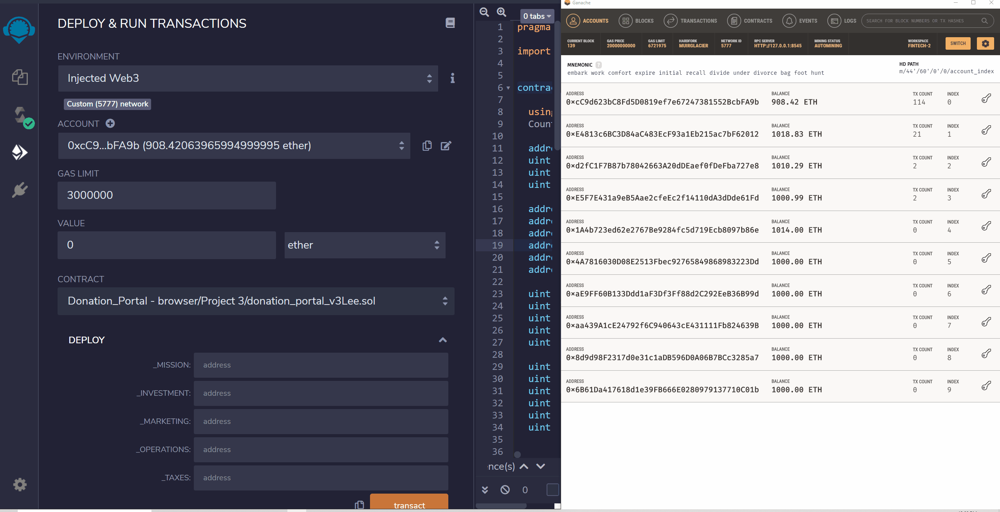

## Welcome to our Charity Donations Project GitHub Page!

The goal of this project was to leverage blockchain technology to create a streamlined process for individuals to donate to desired foundations.  By leveraging smart contracts, donated funds can be tracked on the blockchain, providing visibility to donors of where their donations are being spent.  The grand scope of this project is to enhance donor contribution power and hold foundations accountable for their spending. 

### Research

[Charity Navigator](https://www.charitynavigator.org) was utilized to research charitable organizations and review organization ratings.  Numerous factors are considered when providing ratings, but the below outline provides a brief scope of the ratings:

  - A ranking of 4 means that more than 75% of the money raised goes to the program
  - A ranking of 3 means 66% or more of the money raised goes to the program
  - A ranking of 2 means 50% or more of the money raised goes to the program
  - A ranking of 1 means 33% or more of the money raised goes to the program
  - A ranking of 0 means 33% or less of the money raised goes to the program.
  
Following this research, we identified an opportunity to improve potential shortfalls of fund utilization, which will help organizations gain trust with donors. 

## Solutions: Smart Contracts
Two contracts were created for this project - one to allow direct donations to a desired charity, and another to deploy a crowd sale for donors to participate in to support a charity. 

The Donation_Portal contract accepts donations and distributes funds to set divisions within the charity.  Each division within the charity receives a percentage of each donation.  Percentages by division are defined when interacting with the contract.  An example of this contract in action is below.  



The wingcoin_deployer contract deploys a capped crowd sale and gives donors the ability to purchase WING tokens.  This contract was created as an alternative use case to accept donations and possibly provide donors a stake (token) in the charity following their donation.  The Donation_Portal contract is the primary contract to support the project initiative. An example of interaction with this contract can be found in Resources folder. 

To enhance transparency and useability, a Python script was written to provide currency conversions.  This script accepts fiat currency codes (2 at a time) and outputs conversion rates of the top 10 cryptocurrencies.  The script assumes $1 inputs for each currency, with cryptocurrency conversions outputting accordingly.  An example of the script in action is below. 


### Contract Code Example

More detailed information about this project can be found in the in this project's repository, including full explanation of interaction with each smart contract.  For a visual aide of contract code, below is an example of some of the code that was used to generate and interact with the crowd sale contract. 
```
pragma solidity >=0.4.22 <0.6.0;
// import "./wingcoin.sol";
import "https://github.com/OpenZeppelin/openzeppelin-contracts/blob/release-v2.5.0/contracts/crowdsale/Crowdsale.sol";
import "https://github.com/OpenZeppelin/openzeppelin-contracts/blob/release-v2.5.0/contracts/crowdsale/emission/MintedCrowdsale.sol";
import "https://github.com/OpenZeppelin/openzeppelin-contracts/blob/release-v2.5.0/contracts/crowdsale/validation/CappedCrowdsale.sol";
import "https://github.com/OpenZeppelin/openzeppelin-contracts/blob/release-v2.5.0/contracts/crowdsale/validation/TimedCrowdsale.sol";
    
contract wingcoin_deployer{
    address public token_sale_address;
    address public token_address;
    
    constructor(
        string memory name,
        string memory symbol,
        address payable wing_owner,
        uint256 cap
    ) public
    {
        wingcoin token = new wingcoin(name, symbol, 18);
        token_address = address(token);
        
        wing1 token_sale = new wing1(1, token, wing_owner, cap, now, now + 45 days);
        token_sale_address = address(token_sale);
        
        token.addMinter(token_sale_address);
        token.renounceMinter();
    }
}

```

### Ropsten Test Network Deployment 

All contracts were deployed to the Ropsten test network to allow outside user interaction of the contracts.  The addresses for each contract are provided below.  Each can be viewed by visiting the [Ropsten Testnet Explorer](https://ropsten.etherscan.io/) on Etherscan.

  - Donation_Portal: 0xB53cfb3F0ADA965eFeA53dd4Bc89416017924E10
  - Wingcoin: 0x35f6179788F983e476E1Add22D504829aFE221db
  - Wingcoin_Deployer: 0xE94535635Ebe26F18F6C732281807732e9e1131f
  - Wing1: 0x2185e03D389d5D9BcC0573E15D2A0b3d3D6Db198


### GitHub Repository

The repository that hosts this project can be viewed [here](https://github.com/hageslel/Charity-Donations-on-Blockchain).  Enjoy our project!  
